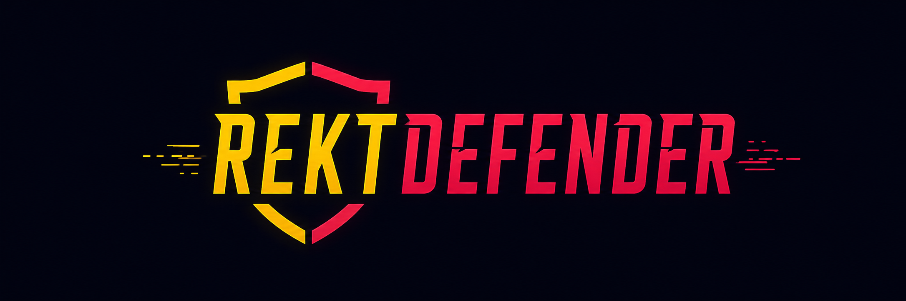

# REKT DEFENDER 🛡️

> **Defend your portfolio. Shoot FUD. Win REKT tokens every week.**



A crypto-themed skill game built on Solana. Players pay 0.10 USDC per game and compete for weekly REKT token prizes. Top 3 scores each week win. Every game fee creates buy pressure on REKT and burns tokens permanently.

🌐 **Live at:** [rektdefender.lol](https://rektdefender.lol)

---

## 🎮 What It Is

Rekt Defender is an original browser-based skill game where players defend their crypto portfolio against waves of enemies — FUD, Rug Pulls, Bears, SEC Agents, Whales, and Paper Hands.

- **Free demo mode** — play instantly, no wallet needed
- **Paid competitive mode** — 0.10 USDC per game via x402 / OpenFacilitator on Solana
- **Weekly leaderboard** — best single game score counts, resets every Monday
- **Top 3 win REKT tokens** — sent directly to winning wallets within 24 hours
- **Hall of Fame** — permanent public record of every weekly winner

---

## 🪙 REKT Token

| Property | Detail |
|---|---|
| Ticker | REKT |
| Network | Solana |
| Total Supply | 1,000,000,000 (fixed) |
| Launch Platform | Hey.LOL (fair launch) |
| Team Allocation | Zero |
| LP Lock | Permanent |
| Mint Authority | Revoked on launch |

**Fee split per game:**
- 50% → Buys REKT on open market for weekly prize pool
- 20% → Buys and burns REKT permanently 🔥
- 30% → Development & operations

---

## 🏆 Prize Structure

Weekly leaderboard resets every Monday at 00:00 UTC.

| Place | Prize |
|---|---|
| 🥇 1st | 60% of weekly pool |
| 🥈 2nd | 30% of weekly pool |
| 🥉 3rd | 10% of weekly pool |

Prizes paid in REKT tokens, bought from the open market using game fees. No minting. No inflation.

---

## 🛠️ Tech Stack

| Layer | Technology |
|---|---|
| Frontend | HTML5 / CSS3 / Vanilla JS |
| Game Engine | HTML5 Canvas |
| Hosting | Vercel |
| Database | Supabase (leaderboard — coming on launch) |
| Payments | x402 / OpenFacilitator on Solana |
| Wallet Support | Phantom, Solflare |
| Token Launch | Hey.LOL |

---

## 📁 Project Structure

```
rekt-defender/
├── index.html          # Landing page
├── game.html           # Playable game (demo mode)
├── leaderboard.html    # Weekly leaderboard & Hall of Fame
├── tokenomics.html     # REKT token whitepaper
├── terms.html          # Terms of service
├── privacy.html        # Privacy policy
├── 404.html            # Custom error page
├── vercel.json         # Vercel routing config
├── REKT_Defender_Banner.png
└── REKT_Defender_Logo.png
```

---

## 🚀 Roadmap

- [x] Game built and playable in demo mode
- [x] Landing page, leaderboard, tokenomics, legal pages
- [x] Deployed to rektdefender.lol via Vercel
- [ ] REKT token fair launch on Hey.LOL
- [ ] x402 payment gate activated (0.10 USDC per game)
- [ ] Supabase leaderboard connected
- [ ] Weekly prizes begin
- [ ] Twitter/X and Hey.LOL community accounts live
- [ ] Automated prize payouts via smart contract

---

## ⚠️ Disclaimer

Rekt Defender is a skill-based game. REKT token has no guaranteed value. Nothing here constitutes financial advice. Do your own research. Not your keys, not your coins. gm. 🌅
